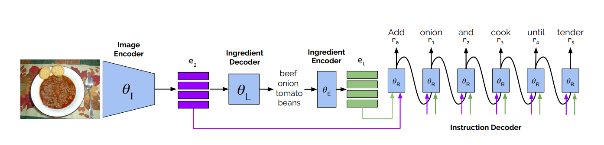
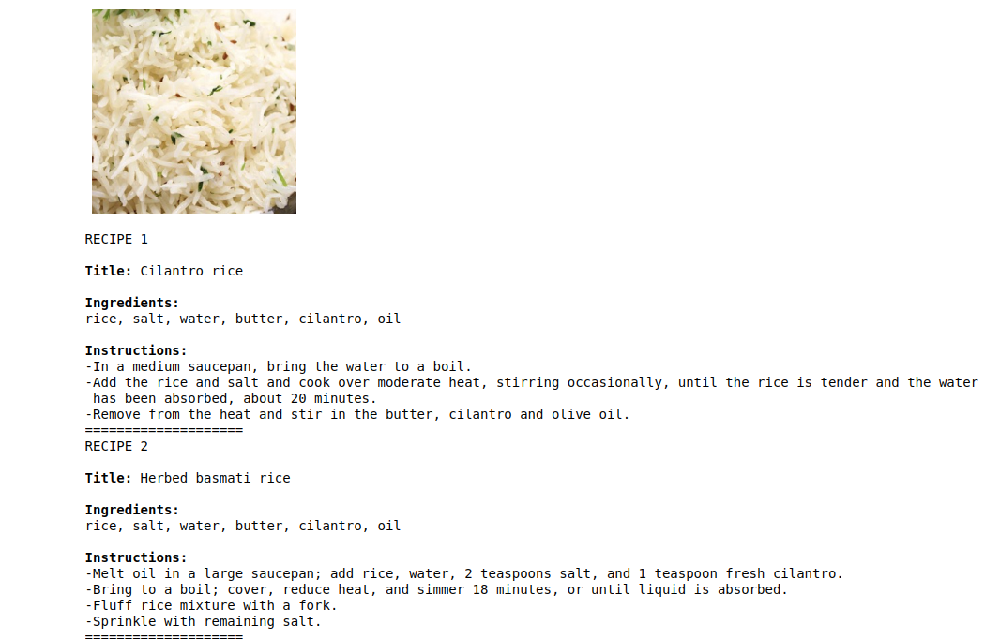

# Inverse Cooking recipe Generation from food images
An auto encoder-decoder with transformer based system to predict the recipe of food from its images.  

## Reference Paper  

1. https://arxiv.org/pdf/1812.06164.pdf  
2. https://nlp.stanford.edu/pubs/emnlp15_attn.pdf    
3. https://medium.com/analytics-vidhya/machine-translation-encoder-decoder-model-7e4867377161    

## Network

## Requirements  

1. numpy  
2. scipy  
3. matplotlib  
4. nltk  
5. Pillow  
6. tqdm  
7. lmdb  
8. tensorflow  
9. tensorboardX  
10. Pytorch 0.4.1  

## Pre-requisites  

1. Transformer  
2. Encoders and Decoders  
3. Attention networks  
4. RNNs  
5. LSTMs  

## Dataset

 The Recipe1M dataset composed of 1 029 720 recipes scraped from cooking websites. The dataset contains 720 639 training,
155 036 validation and 154 045 test recipes, containing a title, a list of ingredients, a list of cooking instructions and
(optionally) an image.  

## Optimisation

In the first stage, we pre-train the image encoder and ingredients decoder. Then, in the second stage, we train the ingredient encoder and instruction decoder by minimizing the <b>negative log-likelihood</b> and adjusting θR and θE.

## Pre-Trained model
1. Find ingredient vocabulary https://dl.fbaipublicfiles.com/inversecooking/ingr_vocab.pkl  
2. Find instruction vocabulary https://dl.fbaipublicfiles.com/inversecooking/instr_vocab.pkl  
3. Find pre-trained model here https://dl.fbaipublicfiles.com/inversecooking/modelbest.ckpt  

## Results

